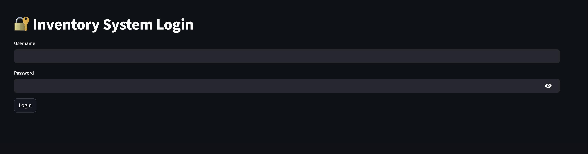
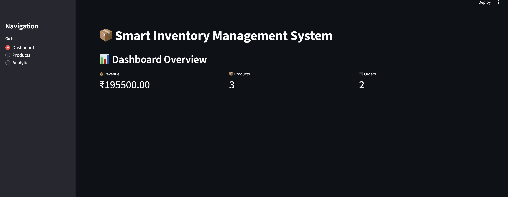
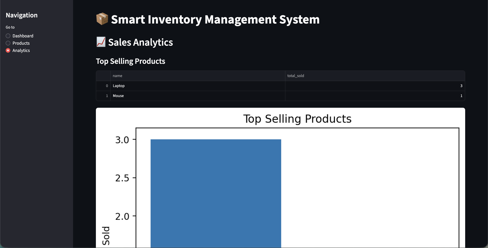

# 📦 Smart Inventory Management System

A full-stack inventory and sales management system built using **Python, MySQL, and Streamlit**.  
The project automates inventory tracking, order processing, stock management, and sales analytics through an interactive dashboard interface.

---

# 🚀 Features

## 🔐 Authentication System
- Secure admin login
- Protected dashboard access
- Session-based authentication
- Logout functionality

---

## 📦 Inventory Management
- Add new products dynamically
- View all available inventory
- Real-time stock tracking
- Supplier integration using relational database mapping

---

## 🛒 Order Management
- Place customer orders
- Automatic stock reduction after purchase
- Multi-table relational order processing
- Order tracking using foreign key relationships

---

## 📊 Sales Analytics Dashboard
- Total revenue tracking
- Product inventory overview
- Order statistics
- Top-selling products visualization
- Low-stock alerts
- Interactive analytics charts

---

# 🛠️ Tech Stack

| Technology | Purpose |
|---|---|
| Python | Backend Logic |
| MySQL | Relational Database |
| Streamlit | Dashboard UI |
| Pandas | Data Handling |
| Matplotlib | Data Visualization |

---

# 🧠 Key Concepts Implemented

- Relational Database Design
- Foreign Keys & Relationships
- CRUD Operations
- SQL JOIN Queries
- Session Authentication
- Backend Business Logic
- Inventory Automation
- Interactive Dashboard Development
- Data Analytics & Visualization

---

# 📂 Project Structure

```text
sql-inventory-management/
│
├── database/
│   ├── schema.sql
│   └── queries.sql
│
├── python/
│   ├── app.py
│   ├── dashboard.py
│   ├── db.py
│   └── inventory.py
│
├── screenshots/
│
├── README.md
└── requirements.txt
```

---

# 📸 Screenshots

## 🔐 Login Page


---

## 📊 Dashboard Overview


---

## 📦 Product Management


---

## 📈 Sales Analytics


---

# ⚙️ Installation Guide

## 1️⃣ Clone Repository

```bash
git clone https://github.com/YOUR_USERNAME/sql-inventory-management.git
cd sql-inventory-management
```

---

## 2️⃣ Install Dependencies

```bash
pip install -r requirements.txt
```

---

## 3️⃣ Configure MySQL Database

Create database using MySQL Workbench:

```sql
CREATE DATABASE inventory_system;
```

Run the provided schema file:

```text
database/schema.sql
```

---

## 4️⃣ Update Database Credentials

Inside:

```text
python/db.py
```

Update:

```python
host="localhost",
user="root",
password="YOUR_PASSWORD",
database="inventory_system"
```

---

## 5️⃣ Run Streamlit Dashboard

```bash
python3 -m streamlit run python/dashboard.py
```

---

# 🔑 Demo Credentials

```text
Username: admin
Password: admin123
```

---

# 📈 Future Improvements

- Password hashing & encryption
- Role-based access control
- Invoice PDF generation
- Customer management system
- REST API integration
- Docker deployment
- AI demand forecasting
- Cloud deployment

---

# 💡 Why This Project Matters

This project demonstrates:
- Real-world database management
- Backend system architecture
- Business workflow automation
- Dashboard development
- Data analytics integration
- Authentication implementation

Unlike basic CRUD projects, this system simulates a practical inventory and sales workflow used in real businesses.

---

# 👨‍💻 Author

Arsh Kumar