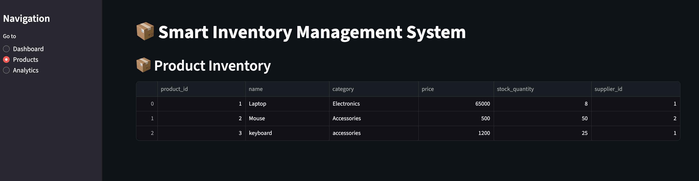

# 📦 Smart Inventory Management System

A full-stack inventory and sales management system built using Python, MySQL, and Streamlit.

## 🚀 Features

- Product inventory management
- Add new products dynamically
- Order placement system
- Automatic stock updates
- Sales analytics dashboard
- Revenue tracking
- Low stock alerts
- Interactive Streamlit UI

---

## 🛠️ Tech Stack

- Python
- MySQL
- Streamlit
- Pandas
- Matplotlib

---

## 📊 Dashboard Features

### Dashboard Overview
- Total revenue
- Product count
- Orders count

### Product Management
- View inventory
- Add products
- Track stock quantity

### Analytics
- Top selling products
- Sales visualization
- Low stock alerts

---

## 📸 Screenshots

### Dashboard


### Analytics


### Products


---

## ⚙️ Installation

### Clone Repository

```bash
git clone https://github.com/YOUR_USERNAME/sql-inventory-management.git
cd sql-inventory-management
```

### Install Dependencies

```bash
pip install -r requirements.txt
```

### Run Streamlit App

```bash
streamlit run python/dashboard.py
```

---

## 🧠 Concepts Used

- Relational Database Design
- Foreign Keys
- SQL JOIN Queries
- CRUD Operations
- Business Logic Automation
- Data Analytics
- Dashboard Development

---

## 📌 Future Improvements

- Authentication system
- Customer management
- Invoice generation
- Export reports as PDF
- AI demand forecasting

---

## 👨‍💻 Author

Arsh Kumar